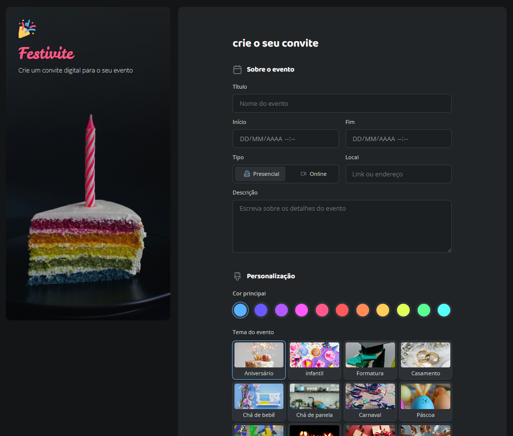

# Repositório Desafio - Formulário de Convite | Festivite

🚀 Um repositório destinado para o desafio prático Formulário de Convite | Festivite, da jornada do curso **Full-Stack** da Rocketseat, ministrado pelo Mayk Brito. ⚒

> Formação Full-Stack: [Nível 4] Avançando no HTML e CSS (Desafio Prático)

O projeto desenvolvido é um site desktop de covite para eventos, com formulário para geração do convite personalizado! 

[🔗 Veja o projeto](https://fesette.github.io/Formulario-convite/)

## 🛠️ Tecnologias

- HTML
- CSS
- Git e Github